[](https://classroom.github.com/a/mRmkZGKe)
# Network Programming - Assignment G01

## Anggota Kelompok
| Nama           | NRP        | Kelas     |
| ---            | ---        | ----------|
| Dimas Setiaji  |  5025241056|     C     |
| Isabella Sienna Sulisthio| 5025241199|  C |


## Link Youtube (Unlisted)
```
https://youtu.be/zUYjz0Mijiw
```

## Penjelasan Program

---
> [The Question] <br>

Build a multi-client terminal app with file transfer! Create four server files and one client file: 

• `server-sync.py` — synchronous (one client at a time) <br>
• `server-select.py` — using the select module <br>
• `server-poll.py` — using the poll syscall <br>
• `server-thread.py` — using the threading module <br>
• `client.py`<br>

Features:
- Broadcast messages to all connected clients
- Client commands:
  - `/list` — list existing files on the server
  - `/upload <filename>` — upload a file to the server
  - `/download <filename>` — download a file from the server
---

> [Program Explanation] <br>

_Repository_ ini terdiri dari beberapa _file_:
* `client.py`: Implementasi _client_ yang terhubung ke server untuk melakukan interaksi kepada _server_ atau _client_ lain dengan mengirim pesan broadcast, _upload_ dan _download file_.
* `server-poll.py`: Server _multiclient_ yang dapat menangani banyak koneksi secara bersamaan dengan _poll syscall_ (untuk Unix/Linux, MacOS, WSL).
* `server-select.py`: Server _multiclient_ yang dapat menangani banyak koneksi secara bersamaan melalui mekanisme _I/O multiplexing_ dengan _select module_.
* `server-sync.py`: Server sinkronus (_blocking_) yang berjalan secara sekuensial dan hanya dapat melayani satu _client_ dalam satu waktu. 
* `server-thread.py`: Server _multiclient_ yang dapat menangani banyak koneksi secara bersamaan dengan membuat _thread baru_(menggunakan _thread module_) untuk setiap _client_ yang terkoneksi.

---

Pada pembuatan TCP-File-Server yang menggunakan metode implementasi yang berbeda-beda ini, kelompok kami menggunakan konfigurasi berikut. 
```Python
HOST = '127.0.0.1'
PORT = 8080
SERVER_DIR = 'server_files'
CLIENT_DIR = 'client_files'
```
Konfigurasi tersebut digunakan sebagai alamat host & port komunikasi antara server dan _client_ serta direktori penyimpanan _file_ pada masing-masing sisi program (_client_ maupun server).

---

**1) [client.py](client.py):**<br>
File `client.py` adalah sebuah program dari sisi _client_ dan berperan sebagai penghubung antara pengguna dan server yang berfungsi untuk: 
* Melakukan koneksi dengan server.
* Mengirim perintah dari _user_.
* Menerima respon dari server.
* Meng-_upload file_.
* Meng-_download file_.
* menerima _broadcast message_ dari server.

Dalam kode `client.py`, program tersebut memiliki beberapa fungsi, yaitu sebagai berikut.
* `send()`: mengirim pesan atau _command_ dari _client_ ke server menggunakan _socket_. Di mana semua pesan akan dikirim dalam format string dan diakhiri dengan karakter newline (`\n`) agar server dapat membaca setiap _command_ secara terpisah.
* `handle_list()`: menangani respon dari server ketika _client_ meminta daftar _file_ yang tersedia (`/list`).
* `handle_file()`: digunakan saat _client_ menerima _file_ dari server (client melakukan `/download <namafile>`), di mana fungsi tersebut akan membuat _file_ baru dalam folder `client_files`, kemudian membaca data _file_ sesuai ukuran yang dikirim server hingga proses _download_ selesai dilakukan.
* `handle_ok()`: menangani pesan sukses dari server kepada _client_ (proses _upload_ atau _download file_ yang berhasil).
* `handle_error()`: menangani pesan _error_ dari server kepada _client_ (_file_ tidak ditemukan / _command_ tidak valid).
* `handle_bcast()`: menangani pesan _broadcast_ yang dikirim server berupa pesan dari satu client kepada semua client yang sedang terhubung.
* `receive_loop()`: fungsi yang dijalankan secara terus menerus agar _client_ dapat menerima respon dari server selama client tersebut masih terhubung dalam server. Fungsi ini dipisahkan dalam _thread_ tersendiri agar _client_ tetap bisa menerima data tanpa mengganggu _input command_ dari pengguna. Respon server akan diproses dalam fungsi ini dengan diarahkan ke _handler_ yang sesuai (ok, error, bcast, list, file). 
* `handle_upload()`: melakukan proses _upload file_ dari _folder_ `client_files` pada client ke server. Fungsi ini pertama-tama akan memeriksa apakah file yang diminta tersedia di folder `client_files`. Jika file tidak ditemukan program akan menampilkan pesan error. Jika file ditemukan, fungsi akan mengambil ukuran file terlebih dahulu, kemudian mengirimkan metadata berupa nama file dan ukuran file ke server. Setelah itu, isi file akan dikirimkan ke server dalam bentuk data biner hingga seluruh file selesai dikirim.
* `main()`: berperan sebagai fungsi utama program yang mengatur seluruh alur client. Fungsi ini memiliki beberapa peran penting agar _client_ dapat terhubung dan berinteraksi dengan server, yaitu:
    * Membuat koneksi ke server dengan socket TCP.
    * Menjalankan thread penerima data agar _client_ dapat menerima respon dari server secara paralel.
    * Membaca _input command_ dari pengguna untuk menentukan aksi yang akan dilakukan, seperti:
        * `/list`: melihat _list file_ yang tersedia di `server_files`.
        * `/upload <namafile>`: meng-_upload_ file yang ada di dalam `client_files` ke `server_files`.
        * `/download <namafile>`: meng-_download_ file yang ada di dalam `server_files` ke dalam `client_files`.
        * `/msg <pesan>`: mengirim pesan _broadcast_ kepada seluruh client yang sedang terhubung ke server.
        * `/exit`: menutup koneksi dengan server.
    * Menutup koneksi dengan server ketika menggunakan `KeyboardInterrupt`. 
---

**2) [server-poll.py](server-poll.py):**<br>
File `server-poll.py` merupakan program dari sisi *server* yang menggunakan mekanisme *event-driven I/O* dengan `select.poll()`. Server ini mampu menangani banyak *client* secara bersamaan tanpa menggunakan *thread*, dengan cara memonitor setiap *socket* dan hanya memproses *socket* yang memiliki *event*.


Mekanisme `poll()` bekerja dengan mendaftarkan *socket* server dan *socket client* ke dalam objek `poller`. Server kemudian akan menunggu *event I/O* yang terjadi pada *socket* tersebut. Ketika terdapat *event*:

* Jika *event* berasal dari *socket server*, maka server akan menerima koneksi *client* baru.
* Jika *event* berasal dari *socket client*, maka server akan membaca data atau *command* dari *client*.
* Jika terjadi *event* `POLLHUP` atau `POLLERR`, maka koneksi *client* akan ditutup melalui fungsi `disconnect()`.

<br>

Dalam kode `server-poll.py`, terdapat beberapa fungsi utama yaitu:

* `send()`: mengirim respon dari server ke *client* menggunakan *socket*. Pesan dikirim dalam format string dan diakhiri dengan karakter *newline* (`\n`) agar dapat diparsing dengan benar oleh *client*.

* `broadcast()`: mengirim pesan dari satu *client* ke seluruh *client* lain yang sedang terhubung. Fungsi ini digunakan saat *client* mengirim `/msg` atau ketika proses *upload file* berhasil.

* `handle_list()`: menangani *command* `/list`. Fungsi ini membaca isi direktori `server_files` dan mengirim daftar nama file ke *client*.

* `handle_download()`: menangani *command* `/download <filename>`. Jika file tersedia di `server_files`, server akan mengirim metadata file (nama dan ukuran), kemudian mengirim isi file dalam bentuk data biner. Jika file tidak ditemukan, server akan mengirim pesan error.

* `disconnect()`: menangani pemutusan koneksi *client*. Fungsi ini akan:
  - menghapus *socket* dari `poller`
  - menghapus data dari `fd_map`, `clients`, dan `buffers`
  - menutup koneksi *socket*

<br>

Selain itu, server menggunakan struktur tambahan yaitu:

* `fd_map`: mapping antara *file descriptor* dan objek *socket*, digunakan untuk mengidentifikasi *socket* berdasarkan event dari `poll()`.

* `clients`: menyimpan pasangan *socket* dan alamat *client*.

* `buffers`: menyimpan data sementara dari *client*, karena TCP bersifat *stream* sehingga data bisa datang tidak terpisah per command.

* `upload_state`: digunakan untuk menangani proses *upload file* secara bertahap. Karena data file dikirim sebagai *stream*, server perlu menyimpan state upload seperti:
  - file yang sedang ditulis
  - jumlah byte yang tersisa
  - nama file

<br>

Proses *upload* dilakukan dengan pendekatan *state machine*:

1. Client mengirim `/upload <filename> <size>`
2. Server menyimpan state ke dalam `upload_state`
3. Server menerima data file secara bertahap menggunakan `recv()`
4. Data ditulis ke file hingga ukuran terpenuhi
5. Setelah selesai:
   - file ditutup
   - server mengirim respon `OK`
   - server melakukan *broadcast* ke client lain

<br>

Fungsi `main()` merupakan inti dari program yang mengatur alur kerja server, yaitu:

* Membuat *socket* server TCP
* Mengatur *socket* dalam mode *non-blocking*
* Mendaftarkan *socket* server ke `poller`
* Menunggu dan memproses *event* dari `poll()`
* Menerima koneksi *client* baru
* Membaca dan memproses *command* dari *client*
* Menangani proses *upload* menggunakan `upload_state`
* Menangani *disconnect client*
* Menghentikan server saat terjadi `KeyboardInterrupt`

---

**3) [server-select.py](server-select.py):**<br>

File `server-select.py` adalah program dari sisi server yang dirancang menggunakan mekanisme _I/O multiplexing_ dengan _select module_ (`select.select()`). Server bertugas untuk menerima koneksi dari banyak _client_ secara bersamaan, dan memproses _command_ dari masing-masing client. 

Penggunaan `select.select()` pada implementasi kode program ini digunakan untuk mendeteksi beberapa _socket_ yang aktif secara bersamaan dalam satu _loop_ utama. Mekanisme `select()` bekerja dengan cara memonitor sekumpulan *socket* dalam sebuah list. Fungsi `select.select()` akan mengembalikan daftar *socket* yang siap untuk dibaca (*readable*). Server kemudian hanya akan memproses *socket* yang aktif tersebut.

Ketika terdapat *event*:
* Jika *socket server* aktif, berarti ada koneksi *client* baru → server akan melakukan `accept()`.
* Jika *socket client* aktif, berarti ada data masuk → server akan membaca *command* dari *client*.
* Jika koneksi terputus atau terjadi error, maka *client* akan di-*disconnect* melalui fungsi `disconnect()`.

<br>

Dalam kode `server-select.py`, terdapat beberapa fungsi utama yaitu:

* `send()`: mengirim respon dari server ke *client* dalam bentuk string yang diakhiri newline (`\n`), agar dapat diparsing dengan benar oleh *client*.

* `broadcast()`: mengirim pesan dari satu *client* ke seluruh *client* lain yang terhubung. Digunakan pada *command* `/msg` dan saat proses *upload* selesai.

* `handle_list()`: menangani *command* `/list`, dengan membaca isi folder `server_files` dan mengirim daftar file ke *client*.

* `handle_download()`: menangani *command* `/download <filename>`. Jika file tersedia, server akan mengirim metadata file (nama dan ukuran), lalu mengirim isi file dalam bentuk biner. Jika tidak ditemukan, server mengirim pesan error.

* `disconnect()`: menangani pemutusan koneksi *client*. Fungsi ini akan:
  - menghapus *socket* dari list `sockets`
  - menghapus data dari `clients` dan `buffers`
  - menutup koneksi *socket*

<br>

Selain itu, terdapat beberapa struktur data penting:

* `sockets`: list yang berisi semua *socket* yang dimonitor oleh `select()` (termasuk server dan client).

* `clients`: menyimpan pasangan *socket* dan alamat *client*.

* `buffers`: menyimpan data sementara dari *client*, karena TCP bersifat *stream* sehingga data bisa datang tidak terpisah per command.

* `upload_state`: digunakan untuk menangani proses *upload file* secara bertahap. Struktur ini menyimpan:
  - file yang sedang ditulis
  - sisa byte yang belum diterima
  - nama file

<br>

Proses *upload file* menggunakan pendekatan *state machine*:

1. Client mengirim `/upload <filename> <size>`
2. Server menyimpan state ke dalam `upload_state`
3. Server menerima data file secara bertahap melalui `recv()`
4. Data ditulis ke file hingga seluruh ukuran terpenuhi
5. Setelah selesai:
   - file ditutup
   - server mengirim respon `OK`
   - server melakukan *broadcast* ke client lain

<br>

Pada fungsi `main()`, alur kerja server adalah sebagai berikut:

* Membuat *socket* server TCP
* Menjalankan server dalam mode *non-blocking*
* Menambahkan *socket* server ke dalam list `sockets`
* Menunggu *event* menggunakan `select.select()`
* Menerima koneksi *client* baru
* Membaca dan memproses *command* dari *client*
* Menangani proses *upload file* menggunakan `upload_state`
* Menangani *disconnect client*
* Menghentikan server saat terjadi `KeyboardInterrupt`

---

**4) [server-sync.py](server-sync.py):**<br>

File `server-sync.py` adalah program dari sisi server yang dirancang secara sinkronus (mode _blocking_) sehingga server hanya bisa menerima satu _client_ pada satu waktu. Selama satu _client_ masih terhubung ke dalam server, maka _client_ lainnya harus menunggu hingga koneksi _client_ pertama tersebut selesai.


Yang menjadi pembeda antara implementasi kode server ini dengan kode program server lainnya ialah implementasi ini hanya membolehkan server menerima satu _client_ pada satu waktu. Oleh karena itu, dalam kode programnya terdapat fungsi tambahan yaitu: `handle_client()` yang bertujuan untuk menangani seluruh komunikasi dengan satu _client_ sebelum server kembali ke process `accept()` untuk menerima koneksi _client_ berikutnya.

Implementasi `server-sync.py` menggunakan mode _blocking_ dimana server akan menunggu satu _client_ untuk terhubung, menerima semua _request_ dari _client_ hingga koneksi _client_ tersebut terputus, dan server tidak akan menerima _client_ lain ketika masih ada koneksi yang terhubung antara _client_ dan server.


<br>

Dalam kode `server-sync.py`, terdapat beberapa fungsi utama seperti berikut.
* `send()`: mengirim respon dari server ke _client_ menggunakan _socket_. Pesan dikirim dengan format string dan diakhiri karakter _newline_ (`\n`) agar client dapat membaca setiap respon secara terpisah.
* `broadcast()`: mengirim pesan _broadcast_ dari satu _client_ ke seluruh _client_ lain yang sedang terhubung ke server. Fungsi ini digunakan ketika ada _client_ yang mengirim _command_ `/msg <pesan>` ke server atau ketika proses _upload file_ berhasil dilakukan.
* `handle_list()`: menangani permintaan client melalui  _command_ `/list`. Fungsi ini akan membaca seluruh isi folder `server_files`, kemudian akan mengirim _list file_ yang ada di dalam folder tersebut ke _client_. 
* `handle_download()`: menangani permintaan _client_ melalui _command_ `/download <namafile>`. Fungsi ini akan mengecek terlebih dahulu apakah _file_ yang hendak di-_download_ ada di dalam `server_files`. Jika ditemukan, maka server akan mengirim metadata berupa nama dan ukuran _file_, kemudian mengirim isi _file_ dalam bentuk data biner. Jika _file_ tidak ditemukan, server akan mengirim pesan _error_.
* `handle_upload()`: menangani proses penerimaan _file_ dari _client_ ke server. Fungsi ini menerima data _file_ sesuai ukuran yang telah dikirim oleh _client_, kemudian menyimpannya ke dalam folder `server_files` hingga seluruh _file_ selesai diterima. Setelah proses selesai, server akan mengirim respon sukses kepada _client_.
* `handle_client()`: menangani seluruh komunikasi dengan satu _client_ selama koneksi berlangsung. Fungsi ini bertujuan untuk membaca _command_ yang dikirimkan _client_, memproses _command_ tersebut, dan menjalankan _handler_ yang sesuai (list, download, upload).
* `main()`: berperan sebagai fungsi utama yang mengatur seluruh alur server, dengan alur kerja sebagai berikut.
    * Membuat _socket_ server TCP.
    * Menjalankan server dalam mode _blocking_.
    * Menunggu koneksi client menggunakan `accept()`.
    * Memproses satu client secara penuh menggunakan fungsi `handle_client()`.
    * Menerima client selanjutnya setelah koneksi sebelumnya selesai.
    * Menutup koneksi server ketika terjadi `KeyboardInterrupt`.  

---

**5) [server-thread.py](server-thread.py):**<br>

File `server-thread.py` merupakan program dari sisi server yang dirancang menggunakan _thread module_, di mana setiap _client_ akan ditangani oleh _thread_ yang berbeda. Server bertugas untuk menerima koneksi dari banyak _client_ secara bersamaan, dan memproses _command_ dari masing-masing client. 

Dalam implementasi ini, server menerima koneksi dengan banyak client dengan membuat _thread_ baru untuk setiap koneksi melalui fungsi `handle_client()`. Setiap _thread_ akan memproses _command_ dari client, seperti: `/list`, `/upload`, `/download`, `/msg`, dan `/exit`. Dengan menggunakan implementasi ini, beberapa _client_ dapat dijalankan secara paralel tanpa harus menunggu koneksi _client_ terdahulu terputus.

<br>

Dalam kode `server-thread.py`, terdapat beberapa fungsi utama seperti berikut.
* `send()`: mengirim respon dari server ke _client_ menggunakan _socket_. Pesan dikirim dengan format string dan diakhiri karakter _newline_ (`\n`) agar client dapat membaca setiap respon secara terpisah.
* `broadcast()`: mengirim pesan _broadcast_ dari satu _client_ ke seluruh _client_ lain yang sedang terhubung ke server. Fungsi ini digunakan ketika ada _client_ yang mengirim _command_ `/msg <pesan>` ke server atau ketika proses _upload file_ berhasil dilakukan.
* `handle_list()`: menangani permintaan client melalui  _command_ `/list`. Fungsi ini akan membaca seluruh isi folder `server_files`, kemudian akan mengirim _list file_ yang ada di dalam folder tersebut ke _client_. 
* `handle_download()`: menangani permintaan _client_ melalui _command_ `/download <namafile>`. Fungsi ini akan mengecek terlebih dahulu apakah _file_ yang hendak di-_download_ ada di dalam `server_files`. Jika ditemukan, maka server akan mengirim metadata berupa nama dan ukuran _file_, kemudian mengirim isi _file_ dalam bentuk data biner. Jika _file_ tidak ditemukan, server akan mengirim pesan _error_.
* `handle_upload()`: menangani proses penerimaan _file_ dari _client_ ke server. Fungsi ini menerima data _file_ sesuai ukuran yang telah dikirim oleh _client_, kemudian menyimpannya ke dalam folder `server_files` hingga seluruh _file_ selesai diterima. Setelah proses selesai, server akan mengirim respon sukses kepada _client_.
* `handle_msg()`: menangani command `/msg <pesan>` dengan men-_forward_ pesan ke seluruh _client_ yang sedang terhubung ke server.
* `handle_client()`: menangani seluruh komunikasi dengan satu _client_ dalam satu _thread_ (membaca _command, menjalankan fungsi _handler_ yang sesuai dengan _command_ yang dijalankan _client_, menutup koneksi ketika _client disconnect_ atau terjadi _error_).
* `main()`: berperan sebagai fungsi utama yang mengatur alur kerja server dengan:
    * Membuat socket server TCP.
    * Menjalankan server dalam mode _listening_.
    * Menerima koneksi _client_ dengan membuat _thread_ baru untuk setiap koneksi menggunakan `threading.Thread()`.
    * Menjalankan `handle_client()` untuk masing-masing _thread_.
    * Menghentikan server ketika terjadi `KeyboardInterrupt`.  
---

## Screenshot Hasil
Berikut adalah hasil pengujian untuk masing-masing implementasi server.

---

## 1. Server Sync (Blocking)

### Server & Client Connect
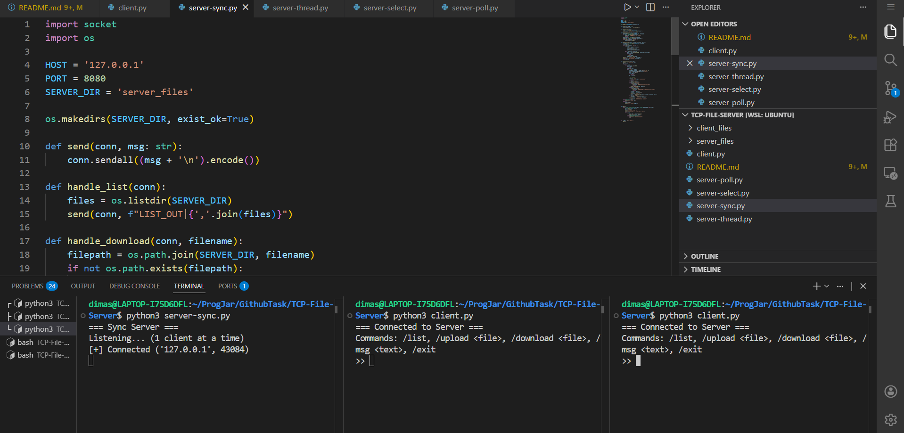
Koneksi antara server dan client berhasil dilakukan, namun server hanya dapat menerima satu client pada satu waktu. Client lain harus menunggu hingga koneksi client pertama selesai.

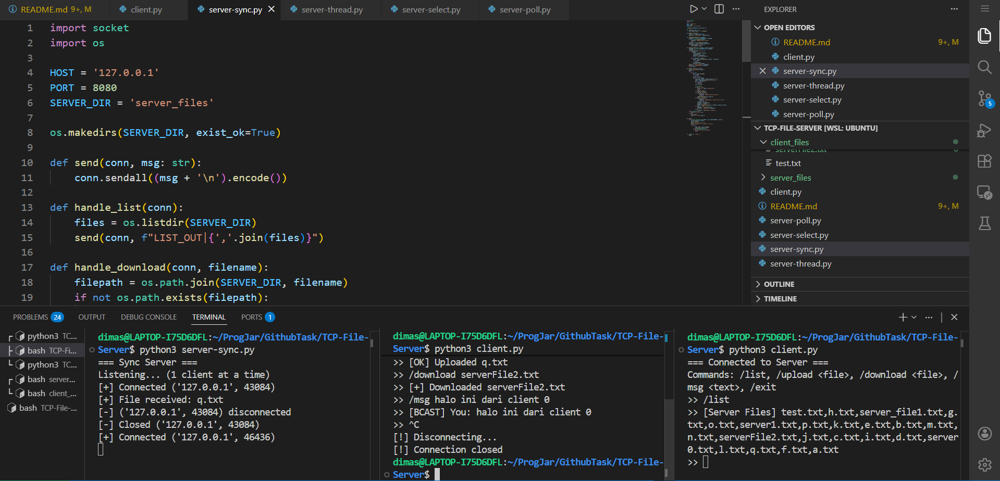
Hanya dapat menerima satu client pada satu waktu, client lain harus menunggu hingga koneksi client pertama selesai. Ketika client pertama terhubung, server akan memproses seluruh command dari client tersebut hingga koneksi terputus, baru server akan menerima client berikutnya.

---

### Perintah `/list`
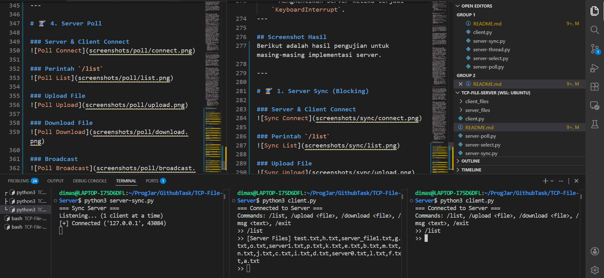
Perintah `/list` berhasil menampilkan daftar file yang tersedia di dalam folder `server_files` pada server.

### Upload File
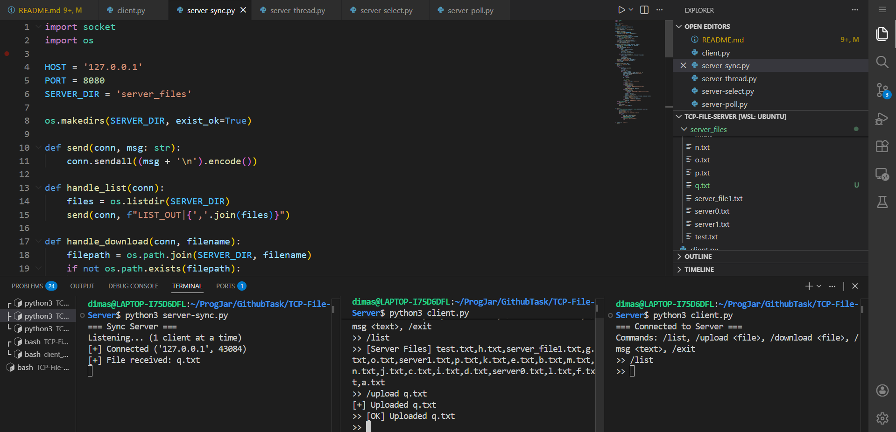
Proses upload file berhasil dilakukan, di mana client mengirim file `q.txt` ke server, kemudian server menyimpan file tersebut ke dalam folder `server_files` dan mengirim respon sukses kepada client.

---

### Download File
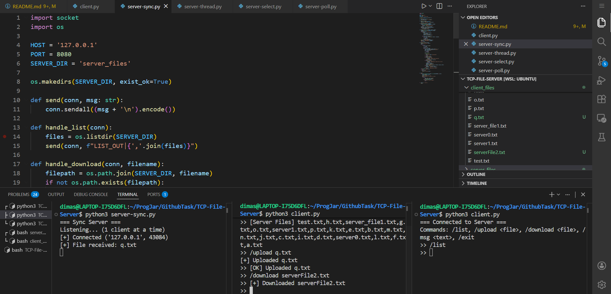
Proses download file berhasil dilakukan, di mana client mengirim perintah `/download serverFile2.txt`, kemudian server mengirim metadata file (nama dan ukuran), lalu mengirim isi file dalam bentuk data biner. Client menerima file tersebut dan menyimpannya ke dalam folder `client_files`.

---

### Broadcast
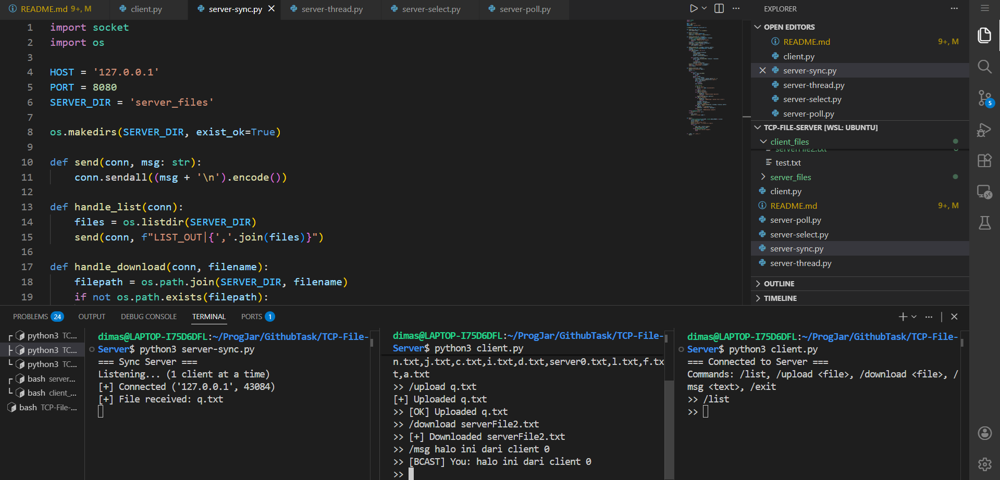
Proses broadcast berhasil dilakukan, di mana client mengirim perintah `/msg halo ini dari client 0`, kemudian server mengirim pesan tersebut ke client yang mengirimnya karena dalam mode sync.

---

### Error Handling
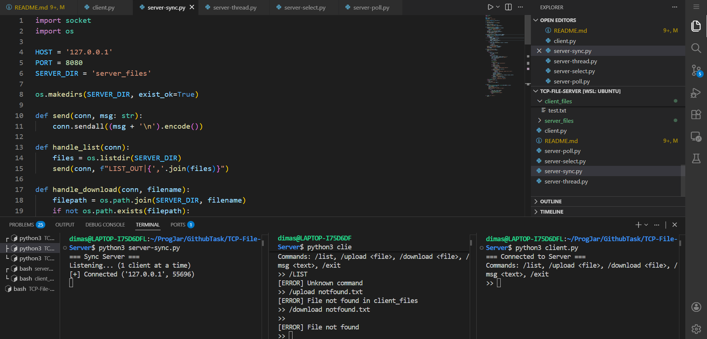
Proses error handling berhasil dilakukan, di mana client mengirim perintah yang tidak valid.

---

## 2. Server Thread

### Server & Client Connect
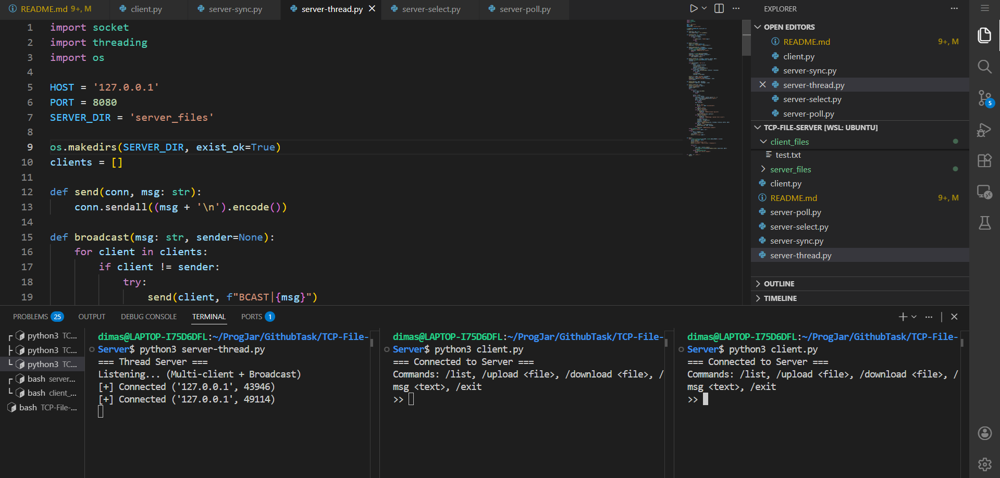
Koneksi antara server dan client berhasil dilakukan, di mana server dapat menerima banyak client secara bersamaan dengan membuat thread baru untuk setiap koneksi. Setiap client dapat berinteraksi dengan server tanpa harus menunggu koneksi client lain selesai.

---

### Perintah `/list`
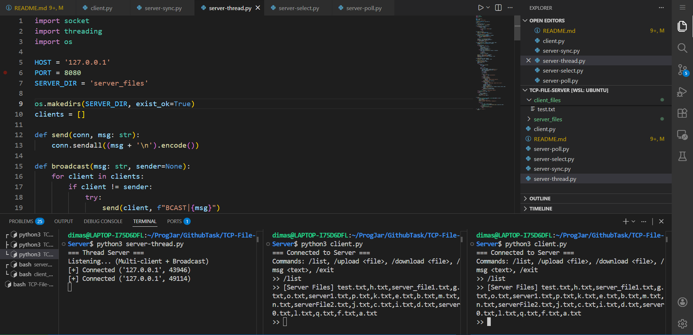
Perintah `/list` berhasil menampilkan daftar file yang tersedia di dalam folder `server_files` pada server untuk masing-masing client yang terhubung.

---

### Upload File
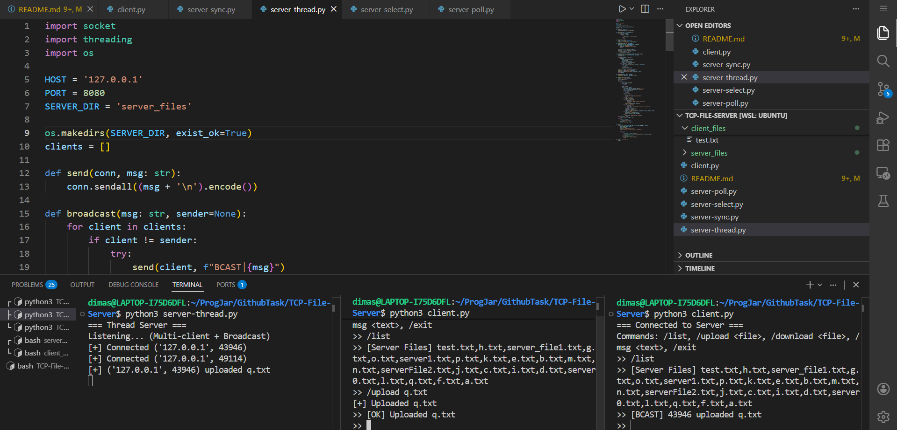
Proses upload file berhasil dilakukan, di mana client mengirim file `q.txt` ke server, kemudian server menyimpan file tersebut ke dalam folder `server_files` dan mengirim respon sukses kepada client. Proses upload dapat dilakukan secara bersamaan oleh beberapa client tanpa harus menunggu koneksi client lain selesai.

---

### Download File
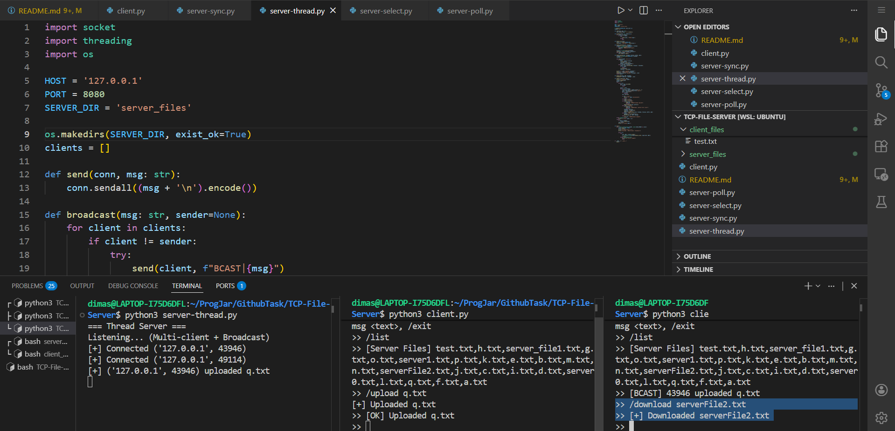
Proses download file berhasil dilakukan, di mana client mengirim perintah `/download serverFile2.txt`, kemudian server mengirim metadata file (nama dan ukuran), lalu mengirim isi file dalam bentuk data biner. Client menerima file tersebut dan menyimpannya ke dalam folder `client_files`. Proses download dapat dilakukan secara bersamaan oleh beberapa client tanpa harus menunggu koneksi client lain selesai.

---

### Broadcast
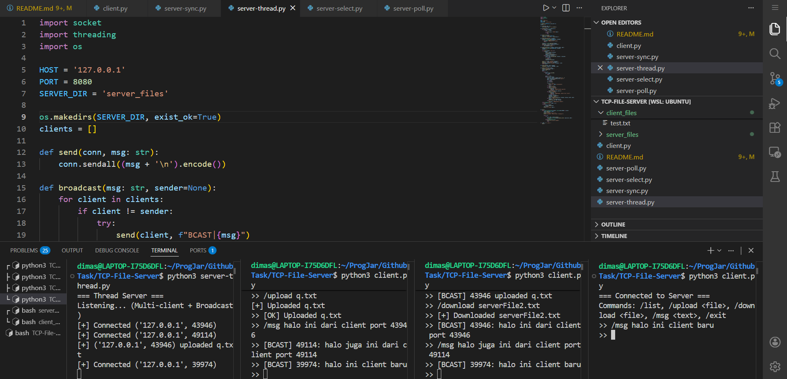
Proses broadcast berhasil dilakukan, di mana client mengirim suatu perintah atau pesan, kemudian server mengirim pesan tersebut ke seluruh client yang sedang terhubung ke server.

---

### Error Handling
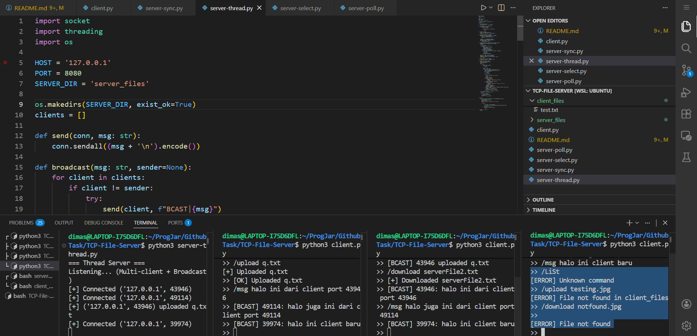
Proses error handling berhasil dilakukan, di mana client mengirim perintah yang tidak valid, kemudian server mengirim pesan error kepada client tersebut.

---

## 3. Server Select

### Server & Client Connect
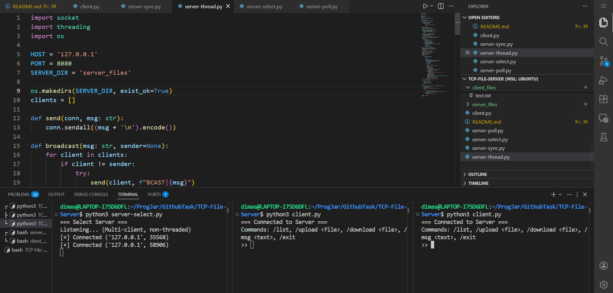
Koneksi antara server dan client berhasil dilakukan, di mana server dapat menerima banyak client secara bersamaan dengan menggunakan mekanisme I/O multiplexing melalui `select.select()`. Setiap client dapat berinteraksi dengan server tanpa harus menunggu koneksi client lain selesai karena server hanya memproses socket yang aktif pada saat itu.

---

### Perintah `/list`
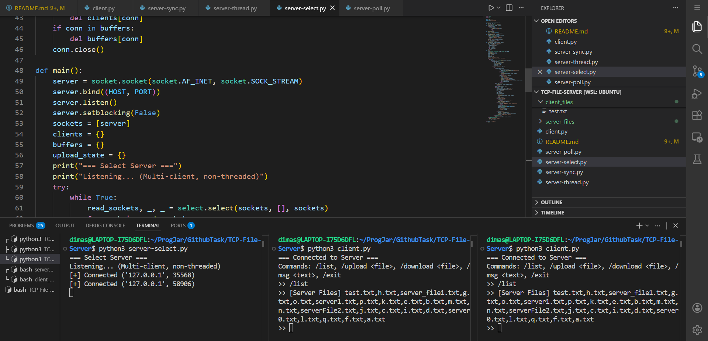
Perintah `/list` berhasil menampilkan daftar file yang tersedia di dalam folder `server_files` pada server untuk masing-masing client yang terhubung. Server dapat memproses perintah dari beberapa client secara bersamaan dengan menggunakan `select.select()` untuk mendeteksi socket yang aktif.

---

### Upload File
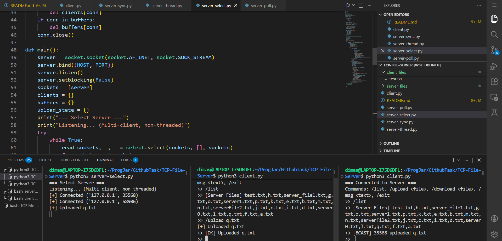
Proses upload file berhasil dilakukan, di mana client mengirim file `q.txt` ke server, kemudian server menyimpan file tersebut ke dalam folder `server_files` dan mengirim respon sukses kepada client. 

---

### Download File
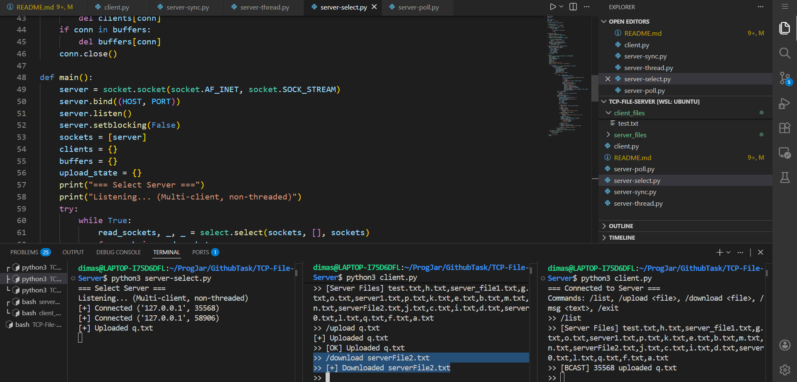
Proses download file berhasil dilakukan, di mana client mengirim perintah `/download [nama_file].txt`, kemudian server mengirim metadata file (nama dan ukuran), lalu mengirim isi file dalam bentuk data biner.

---

### Broadcast
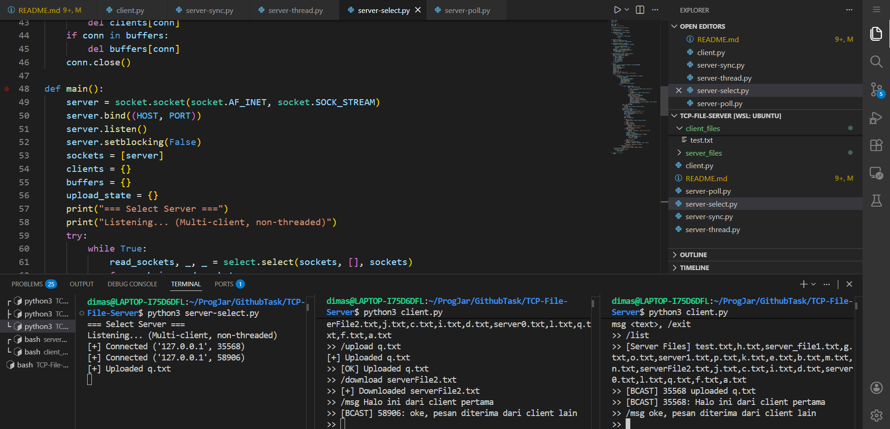
Proses broadcast berhasil dilakukan, di mana client mengirim suatu perintah atau pesan, kemudian server mengirim pesan tersebut ke seluruh client yang sedang terhubung ke server.

---

### Error Handling
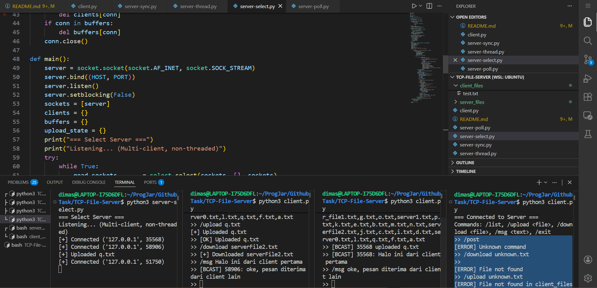
Proses error handling berhasil dilakukan, di mana client mengirim perintah yang tidak valid, kemudian server mengirim pesan error kepada client tersebut.

---

# 4. Server Poll

### Server & Client Connect
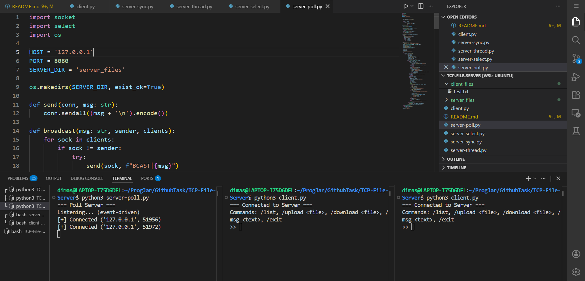
Koneksi antara server dan client berhasil dilakukan, di mana server dapat menerima banyak client secara bersamaan dengan menggunakan mekanisme event-driven I/O melalui `select.poll()`. Setiap client dapat berinteraksi dengan server tanpa harus menunggu koneksi client lain selesai karena server hanya memproses socket yang memiliki event pada saat itu.

---

### Perintah `/list`
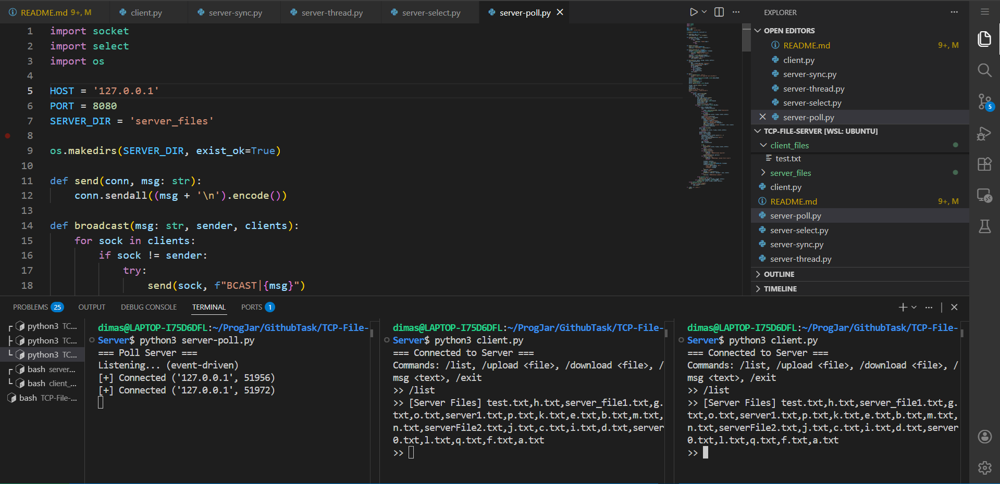
Perintah `/list` berhasil menampilkan daftar file yang tersedia di dalam folder `server_files` pada server untuk masing-masing client yang terhubung. Server dapat memproses perintah dari beberapa client secara bersamaan dengan menggunakan `select.poll()` untuk mendeteksi socket yang memiliki event.

---

### Upload File
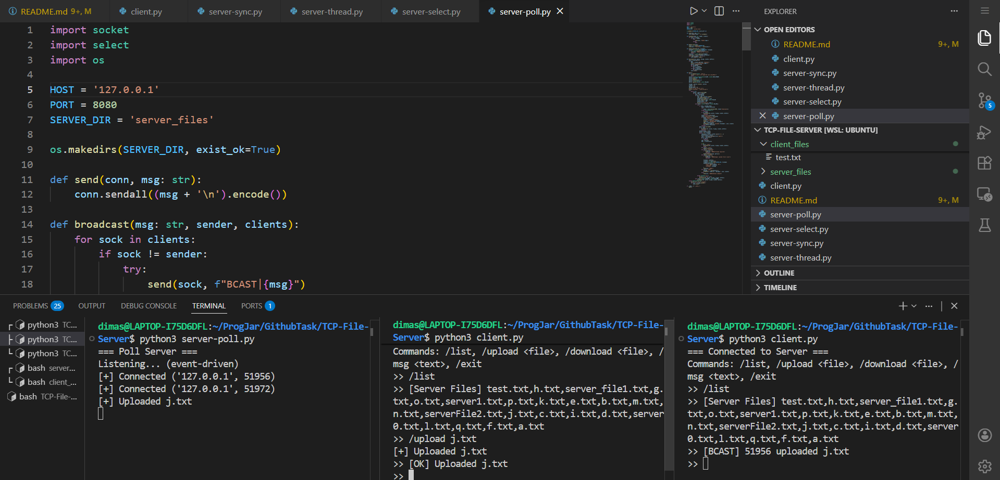
Proses upload file berhasil dilakukan, di mana client mengirim file `q.txt` ke server, kemudian server menyimpan file tersebut ke dalam folder `server_files` dan mengirim respon sukses kepada client. 

---

### Download File
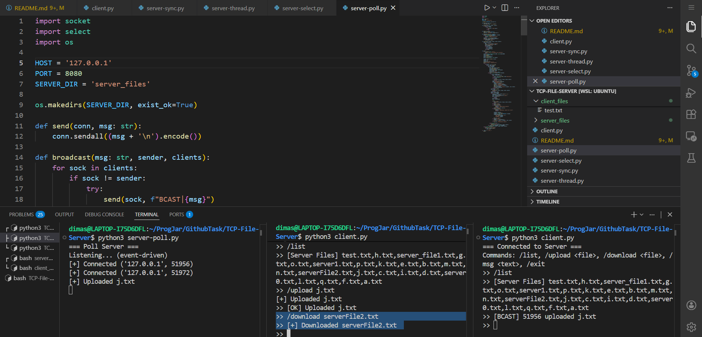
Proses download file berhasil dilakukan, di mana client mengirim perintah `/download [nama_file].txt`, kemudian server mengirim metadata file (nama dan ukuran), lalu mengirim isi file dalam bentuk data biner.

---

### Broadcast
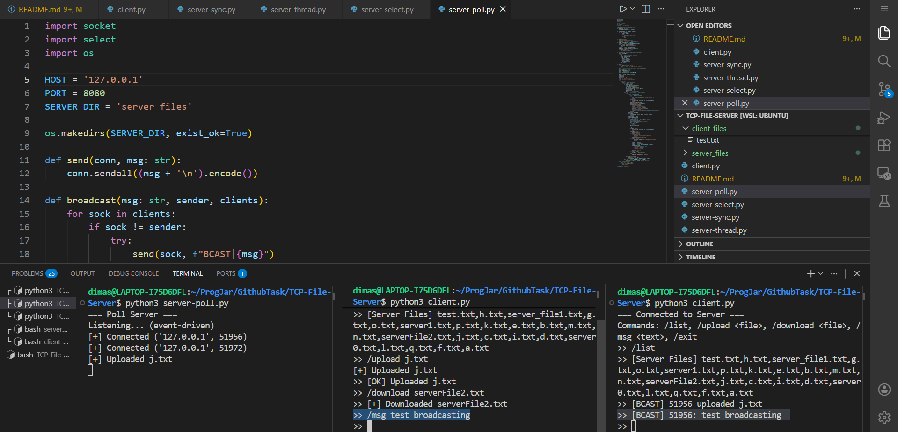
Proses broadcast berhasil dilakukan, di mana client mengirim suatu perintah atau pesan, kemudian server mengirim pesan tersebut ke seluruh client yang sedang terhubung ke server.

---

### Error Handling
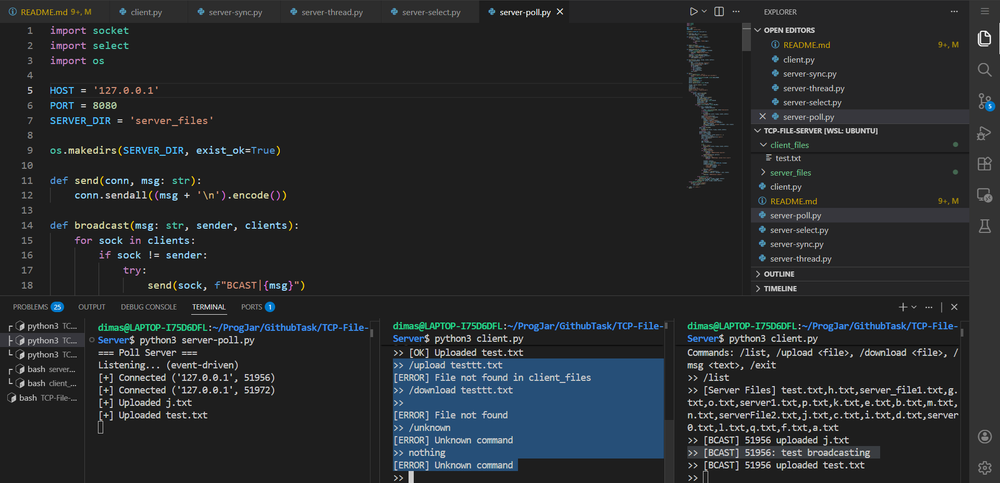
Proses error handling berhasil dilakukan, di mana client mengirim perintah yang tidak valid, kemudian server mengirim pesan error kepada client tersebut.